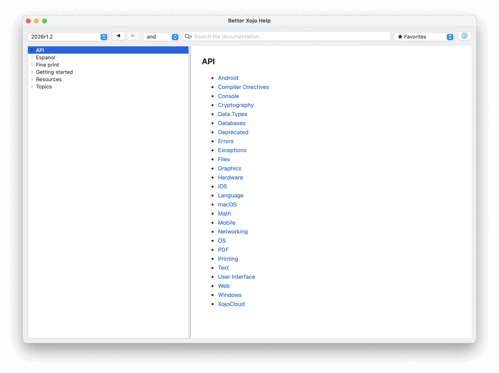
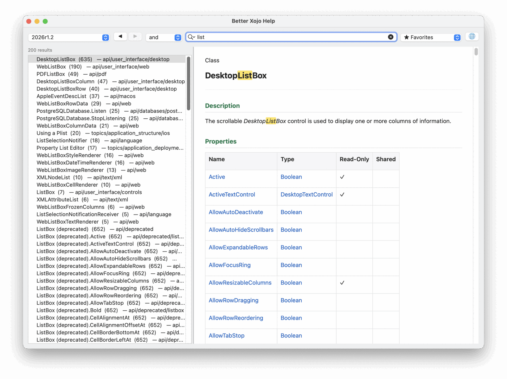
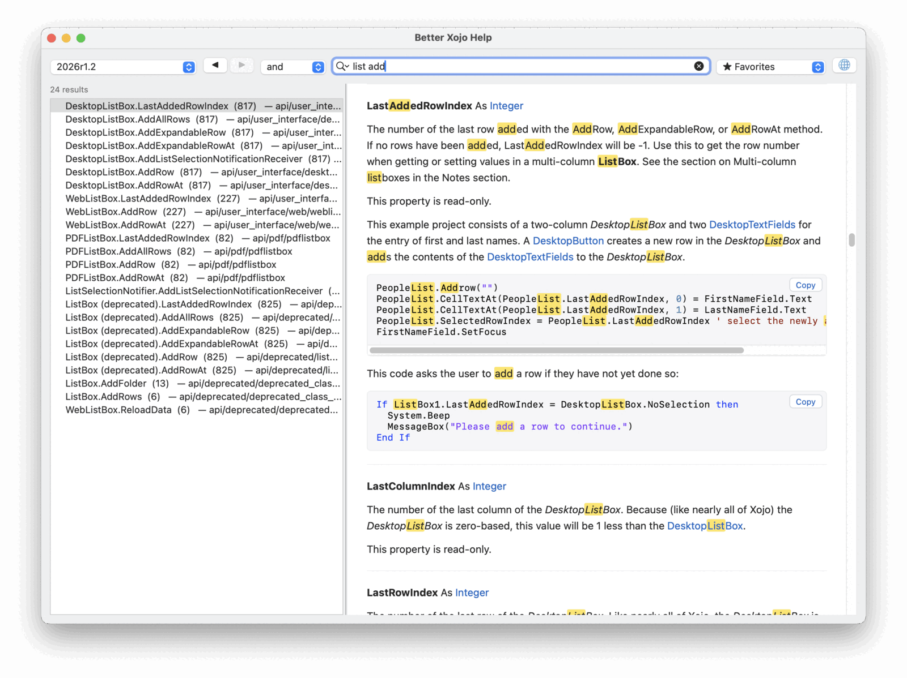
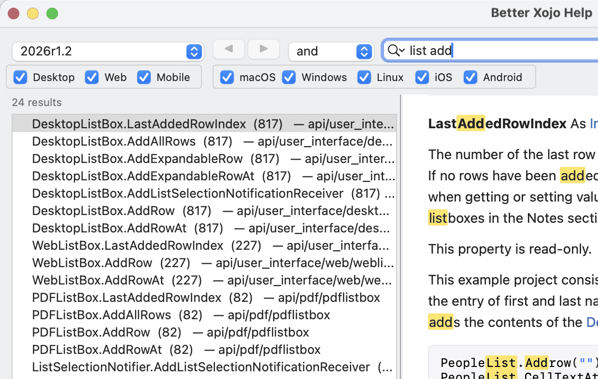

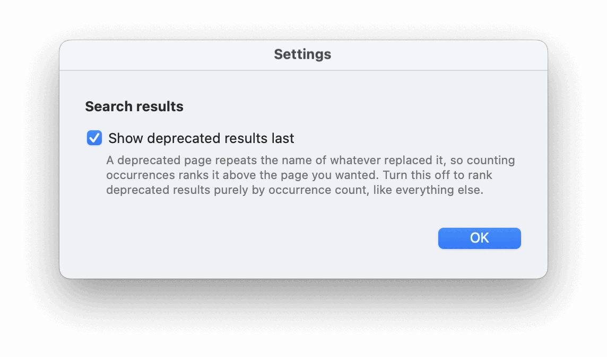
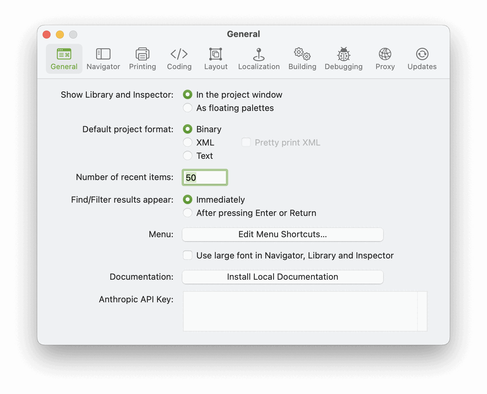

# Better Xojo Help

Every set of Xojo offline documentation installed on your machine, browsable from one window.



Xojo ships documentation with each release, but the IDE only reaches the docs of the version it
belongs to, and the older releases store theirs in a format nothing opens any more. This reads all of
them — 30 releases on the machine it was built on — and lets you switch between them from a popup.

**The reason I wrote it was search.** Finding the exact thing you are after in Xojo's own help is
harder than it should be: you know the class and you know roughly what the method is called, and you
still end up scrolling. Here you type `list add`, pick `and`, and get the seven `DesktopListBox`
members that match — deprecated ones pushed to the bottom, not the top.

And it is **fast**. There is no index to build on first run — both documentation formats already ship
one, and the app reads them where they are — so results appear as you type.

Nothing leaves your machine, and nothing is written outside the app's own folder. Your Xojo
installation is only ever read.

### The difference a second word makes

`list` on 2026r1.2 — 200 results, which is the cap, and you are back to scrolling:



`list add`, still on `and` — 24, with every `DesktopListBox` member that adds a row at the top and
everything deprecated pushed to the bottom:



Both terms are highlighted throughout the page, and the result count sits above the list.

## What it does

- **Browses every installed release** from one window, opening on the newest.
- **Searches titles, paths and members**, ranked by how often the term actually appears in the page.
  On 2026r1.2 that is 15 502 members that page-level search cannot see, because in the modern
  documentation only a *deprecated* member gets a page of its own — a live one like
  `DesktopListBox.AddRow` is a section inside its class page.
- **`and` / `or` / `exact`** for multi-word queries — the popup left of the search field. `and` is
  what makes a half-remembered name findable: two words you are sure of, in any order, across the
  title and the path. A single word behaves identically in all three.
- **Deprecated results sort last**, whatever their score. A deprecated page repeats the name of its
  replacement, so counting occurrences ranks it highest exactly where it is least wanted. Switchable in
  Settings, if you would rather rank them like everything else.
- **Narrows by platform** — Desktop / Web / Mobile and macOS / Windows / Linux / iOS / Android, read
  from each page's own Compatibility table. See below.
- **Links work**, on both documentation formats, and open in the app rather than a browser.
- **Tabs.** Cmd-click a link or a topic to open one behind what you are reading, and keep reading.
- **Back and Forward**, favorites (Cmd+D), and a globe that opens the current page on
  documentation.xojo.com.
- **Works offline**, by construction: the pages are re-rendered locally with the app's own stylesheet,
  so nothing is ever fetched from a CDN.

## Narrowing by platform

Two rows of the Xojo documentation's own `Compatibility` table, as two groups of checkboxes: the
**project types** on the left, the **operating systems** on the right.



They are separate axes and a page has to satisfy both, which is the whole point — untick `Web` and
`WebListBox.AddRow` goes, even though a web app really does run on macOS. Right-click either group
for Check All / Check None.

Pages that say nothing about platforms — the language reference, the topics, 1337 of 2123 pages on
2026r1.2 — always match, so no combination of boxes can hide `String`.

## Tabs

Cmd-clicking a link opens it in a tab behind the page you are on, so you can follow three or four
references without losing your place. Cmd+T, Cmd+W, and the `+` at the end of the strip.



## Settings



## The three formats

Xojo has shipped its offline documentation three different ways, and hiding that is most of what this
app does.

| Era | Releases | Format |
|---|---|---|
| **Sphinx** | 2022r1.1 → 2026r1.2 | Read-the-Docs HTML plus a `searchindex.js` |
| **Legacy** | 2015r2.1 → 2019r1.1 | SQLite: HTML blobs and an FTS4 index |
| MediaWiki | 2013r1 → 2013r3.3 | Raw wikitext — **not supported** |

`2019r2` through `2022r1` shipped no local documentation at all, so those releases legitimately do not
appear. That is Xojo's doing, not a bug here.

## Download

The current signed and notarised build is in [`Binaries/`](Binaries), and every version is on the
[Releases page](https://github.com/JYPochez/VNS-Better-Xojo-Help/releases). Unzip and drag to
Applications — it opens without a Gatekeeper warning, so you do not need a Xojo licence to run it.

Intel and Universal builds are not provided yet. Building from source works on either; see below.

## First: install Xojo's local documentation

**Xojo does not install its documentation by default.** If this app tells you it found nothing, that
is why — and it is worth doing once per release you care about, because each one installs its own copy
and this app reads all of them.

In Xojo: **Preferences → General → Documentation → Install Local Documentation**.



Repeat it in each Xojo version you have installed. The docs land in
`~/Library/Application Support/Xojo/Xojo/Xojo <release>/`, which is where this app looks.

Note that `2019r2` through `2022r1` shipped no local documentation at all, so those releases will
never appear no matter what you click.

### If you cannot run that version of Xojo any more

You do not actually need to launch the IDE. **Every modern Xojo application bundle already carries
the whole documentation set inside it**, at:

    Xojo.app/Contents/Resources/Language Reference/docs.tgz

That archive is the `Documentation` folder, exactly as the IDE would install it — same 25 entries,
`searchindex.js` and all. So if the release is too old to launch on your current macOS, or its
download server is long gone, unpack it by hand. Substitute the release you are unpacking:

```bash
VER="2025r3.1"
APP="/Applications/Xojo $VER/Xojo.app"          # wherever that release actually lives
DEST="$HOME/Library/Application Support/Xojo/Xojo/Xojo $VER/Documentation"

mkdir -p "$DEST"
tar xzf "$APP/Contents/Resources/Language Reference/docs.tgz" -C "$DEST"
```

The destination folder name has to match the release, because that is the string the version popup
reads. Restart Better Xojo Help and it appears.

The archive is around 190 MB compressed, so this is not fast, but it is the only step. Verified on
2025r3.1 and 2026r1.2; the pre-2022 releases store their documentation as a SQLite database instead
and have no `docs.tgz` to extract.

## Requirements

- macOS. The code carries per-platform paths for Windows and Linux, but neither has been tested.
- At least one Xojo release with its **local documentation installed** — see above; this is the step
  people miss.
- Xojo 2021r3 or later to build it (the project uses API 2.0 throughout).

## Building

Open `Better Xojo Help.xojo_project` in Xojo and run. There is nothing to configure and no
dependencies to fetch.

To build a signed copy you will need your own Apple Developer ID: the signing identity and
notarisation credentials are stripped from the published project, so the Sign build step is blank
until you fill it in.

## Feedback

There is a thread on the Xojo forum — questions, bug reports and suggestions are welcome there:
[Better Xojo Help — browse every installed Xojo doc set from one window](https://forum.xojo.com/t/better-xojo-help-browse-every-installed-xojo-doc-set-from-one-window-open-source/)

## Licence

MIT — see [LICENSE](LICENSE).
